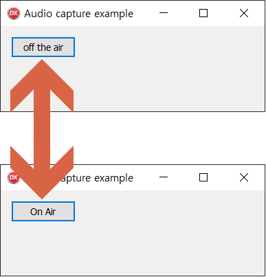

# Hide UI detail codes

This is a small tip for hiding extra codes from the mainstream.

Suppose you have to write a program that starts broadcasting when you press a button
and stops broadcasting when you press that button again.



You can write all the code in the form unit,
but it will obscure the fundamental purpose and be hard to understand.

You can solve this by building a new button component and hiding details in that component.
But it will require you to register that component to use it on form designer.
Unless that component is for general use, it's quite a hassle.
So I suggest you use the following method.

This method allows you to use the form designer without registering a new component,
and you can only add additional functions by delegating them to another unit.

The complete source code is here.
* [https://github.com/ryujt/ryulib-delphi/tree/master/Examples/Audio/AudioSender](https://github.com/ryujt/ryulib-delphi/tree/master/Examples/Audio/AudioSender)

## Form unit

``` pas
unit _frAudioControl;

interface

uses
  StartCaptrueButton,
  Winapi.Windows, Winapi.Messages, System.SysUtils, System.Variants, System.Classes,
  Vcl.Graphics, Vcl.Controls, Vcl.Forms, Vcl.Dialogs, Vcl.Imaging.jpeg,
  Vcl.ExtCtrls, Vcl.StdCtrls;

type
  TfrAudioControl = class(TFrame)
    btStartCaptrue: TButton;
    procedure btStartCaptrueClick(Sender: TObject);
  private
  public
    constructor Create(AOwner: TComponent); override;
  end;

implementation

{$R *.dfm}

{ TfrAudioControl }

procedure TfrAudioControl.btStartCaptrueClick(Sender: TObject);
var
  button : TStartCaptrueButton absolute Sender;
begin
  if button.OnAir then ShowMessage('Let''s start broadcast!');
end;

constructor TfrAudioControl.Create(AOwner: TComponent);
begin
  inherited;

  TStartCaptrueButton.Create(btStartCaptrue, btStartCaptrueClick);
end;

end.
```

## StartCaptrueButton unit

``` pas
unit StartCaptrueButton;

interface

uses
  Winapi.Windows, System.SysUtils, System.Variants, System.Classes,
  Vcl.StdCtrls;

type
  TStartCaptrueButton = class (TButton)
  private
    FTargetButton : TButton;
    FTargetOnClick : TNotifyEvent;
    procedure onClick(Sender: TObject);
  private
    FOnAir : boolean;
    FOnClick : TNotifyEvent;
  public
    constructor Create(AOwner:TComponent; AOnClick:TNotifyEvent); reintroduce;
    destructor Destroy; override;
  published
    property OnAir : boolean read FOnAir;
  end;

implementation

{ TStartCaptrueButton }

constructor TStartCaptrueButton.Create(AOwner:TComponent; AOnClick:TNotifyEvent);
var
  button : TButton absolute AOwner;
begin
  inherited Create(AOwner);

  FOnAir := false;
  FOnClick := AOnClick;

  FTargetOnClick := button.OnClick;
  button.OnClick := onClick;
  FTargetButton := button;
end;

destructor TStartCaptrueButton.Destroy;
begin

  inherited;
end;

procedure TStartCaptrueButton.onClick(Sender: TObject);
begin
  FOnAir := not FOnAir;
  if FOnAir then FTargetButton.Caption := 'On Air'
  else FTargetButton.Caption := 'off the air';

  if Assigned(FOnClick) then FOnClick(Self);
end;

end.
```