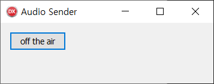

# Example of sending and receiving audio

This post is a simple example of capturing, compressing and transmitting audio.

## Executable demo

* [sending and receiving audio.zip](./sending%20and%20receiving%20audio.zip)

Execute the test_AudioReceiver.exe file.


Execute the test_AudioSender.exe file.


Click the "off the air" button and say something.

    Watch out for howling.
    Keep the microphone away from the speaker.

## Source codes

### Delphi
* [AudioSender](https://github.com/ryujt/ryulib-delphi/tree/master/Examples/Audio/AudioSender)
* [AudioReceiver](https://github.com/ryujt/ryulib-delphi/tree/master/Examples/Audio/AudioReceiver)

### C++
* [RyuLib for C++](https://github.com/ryujt/ryulib-cpp)
* [AudioZip.dll](https://github.com/ryujt/ryulib-cpp/tree/master/dll/AudioZip)

## Important classes

### TAudioZip ([AudioZip.pas](https://github.com/ryujt/ryulib-delphi/blob/master/Src/AudioZip.pas))

``` pas
type
  TAudioZip = class
    {*
      Start capturing and compressing audio data.
      @param ADeviceID ID of the audio device to capture (-1 is the default device)
      @param AUseSystemAudio Decide whether to capture system audio.
    *}
    function Start(ADeviceID:integer; AUseSystemAudio:boolean=false):boolean;

    {*
      Stop capturing and compressing audio data.
    *}
    procedure Stop;

    property MicMuted : boolean read GetMicMuted write SetMicMuted;
    property SystemAudioMuted : boolean read GetSystemAudioMuted write SetSystemAudioMuted;
    property MicVolume : single read Get_MicVolume write Set_MicVolume;
    property SystemAudioVolume : single read GetSystemAudioVolume write SetSystemAudioVolume;
    property OnSouce : TDataEvent read FOnSouce write FOnSouce;
    property OnEncode : TDataEvent read FOnEncode write FOnEncode;
    property OnEror : TIntegerEvent read FOnEror write FOnEror;
  end;
```

### TAudioUnZip ([AudioZip.pas](https://github.com/ryujt/ryulib-delphi/blob/master/Src/AudioZip.pas))

``` pas
type
  TAudioUnZip = class
    {*
      Decompresse auido data and paly it.
      @parm AData Address of compressed audio data.
      @param ASize Size of the compressed audio data.
    *}
    procedure Play(AData:pointer; ASize:integer);

    {*
      Drop audio packets at the front of the buffer by a given number.
      This method will remove delays caused by voice transmission and reception.
      @param ACount Number of audio data to skip
    *}
    procedure Skip(ACount:integer);

    property DelayCount : integer read GetAudioUnZipDelayCount;
    property Muted : boolean read FMuted write FMuted;
    property Volume : single read GetVolume write SetVolume;
    property OnEror : TIntegerEvent read FOnEror write FOnEror;
  end;
```

### TUDPSocket ([UDPSocket.pas](https://github.com/ryujt/ryulib-delphi/blob/master/Src/UDPSocket.pas))

``` pas
type
  TUDPSocket = class(TComponent)
    {*
      Start UDP socket.
      @param ANeedBinding If ANeedBinding is true, it becomes a server socket.
    *}
    procedure Start(ANeedBinding:boolean=true);

    {*
      Stop UDP socket.
    *}
    procedure Stop;

    {*
      Send binary data to the APort of an AHost.
    *}
    procedure SendTo(const AHost:string; APort:integer; AData:pointer; ASize:integer); overload;

    {*
      Send text data to the APort of an AHost.
    *}
    procedure SendTo(const AHost:string; APort:integer; AText:string); overload;

    property Active : boolean read FActive;
    property Port : integer read FPort write SetPort;
    property IsServer : boolean read FIsServer;
    property BufferSize : integer read FBufferSize write SetBufferSize;
    property TimeOutRead : integer read FTimeOutRead write FTimeOutRead;
    property TimeOutWrite : integer read FTimeOutWrite write FTimeOutWrite;
    property OnReceived : TUDPReceivedEvent read FOnReceived write FOnReceived;
  end;
```