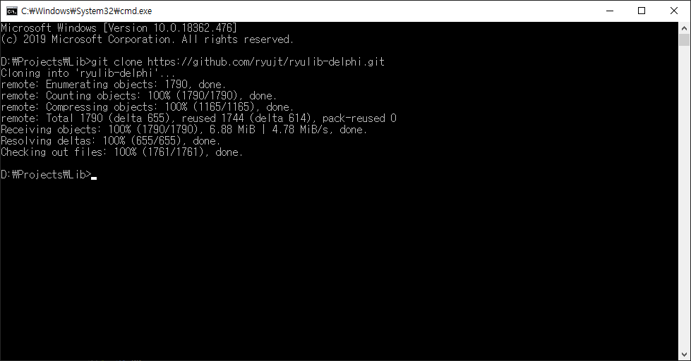
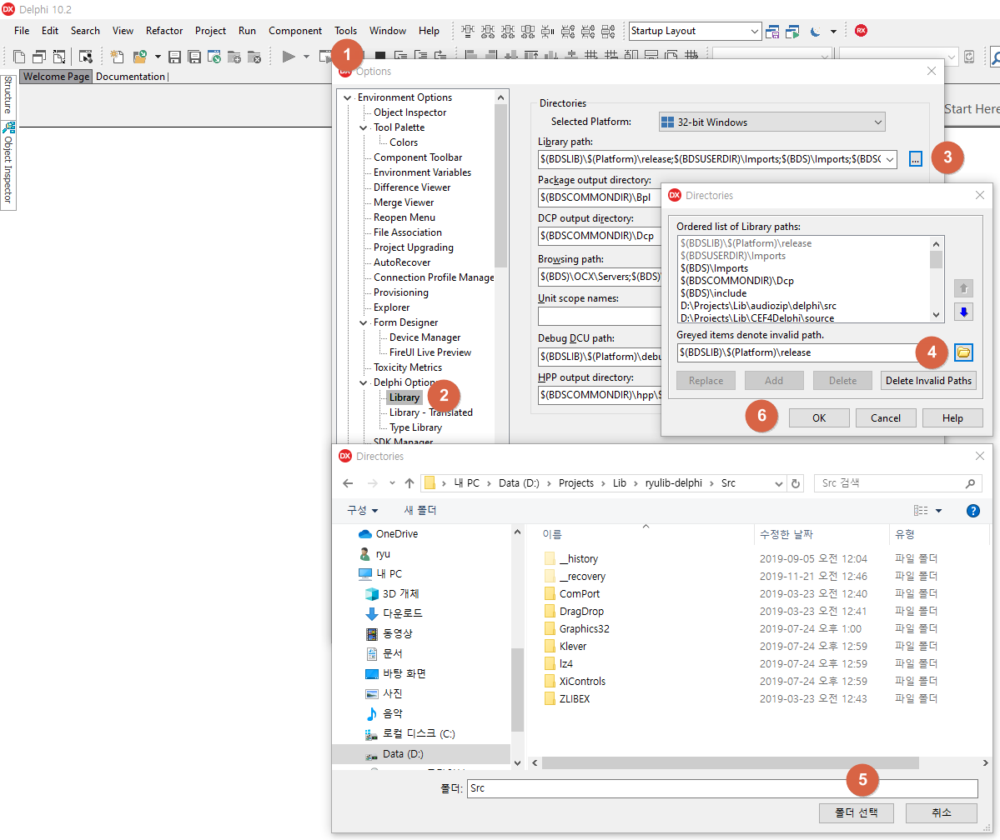
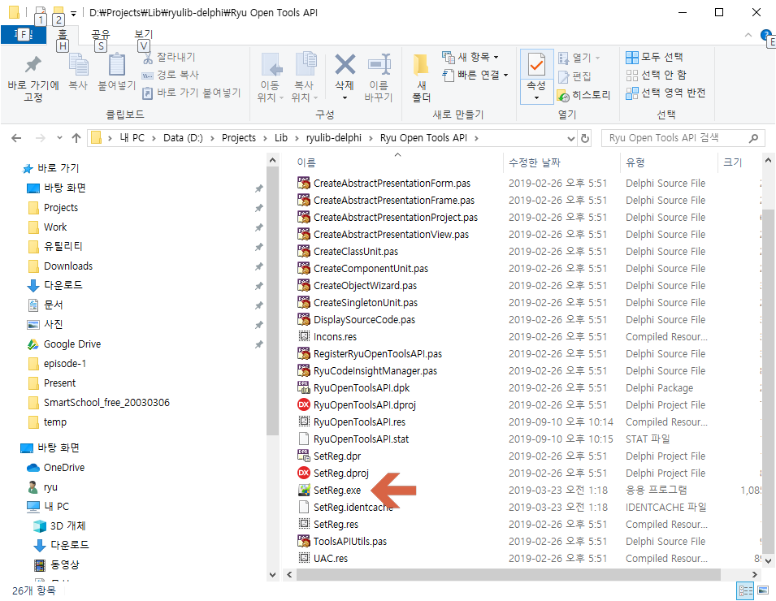
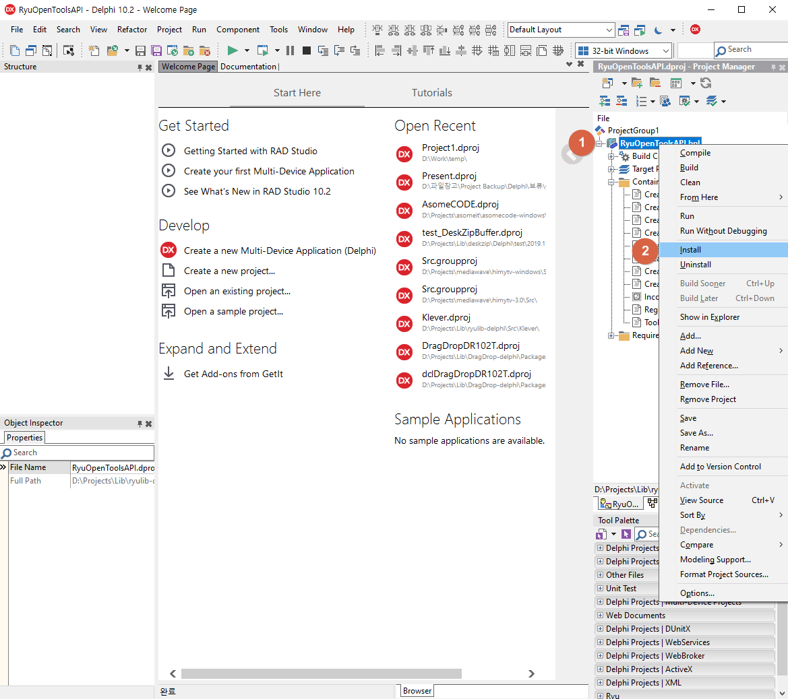

# RyuLib for Delphi 설치

## 개요

개인적으로 자주 사용하는 델파이 관련 라이브러리 묶음입니다. 대부분은 제가 만든 것이고 공개 라이브러리 중 자주 쓰는 넘들도 있습니다.

::: warning
1988년 터보 파스칼을 시작한 이후로 코드를 거의 변경하지 않고 가지고 있는 많이 구린 소스들도 있습니다 :)
:::

## 준비 사항

* git
* Delphi XE2 또는 그 이후 버전
* [https://github.com/ryujt/ryulib-delphi](https://github.com/ryujt/ryulib-delphi) 예제 다운로드

## 설치 및 설정

### git clone

* git이 설치되어 있다면 "git clone https://github.com/ryujt/ryulib-delphi.git"를 명령 프롬프트에서 실행하여 예제를 다운받습니다.

### Library path 추가

1. 메인 메뉴의 Tools를 클릭하고 Options를 클릭하여 옵션 창을 엽니다.
2. 옵션 창에서 Library를 클릭하고
3. "Library path" 항목의 오른쪽 끝에있는 "..." 버튼을 클릭합니다.
4. Directories 창이 나타나면 폴더 모양의 버튼을 클릭합니다.
5. RyuLib의 Src 폴더를 선택하시고 "폴더 선택" 버튼을 클릭합니다.
6. Add 버튼을 클릭하여 추가합니다. 추가작업이 끝나면 Ok 버튼을 클릭하여 창을 닫습니다.

### Ryu Open Tools API 경로 설정

* "Ryu Open Tools API" 폴더에 있는 SetReg.exe를 실행합니다. 그러면 "Ryu Open Tools API"에서 필요한 파일이 있는 경로가 설정됩니다.

### Ryu Open Tools API 설치

1. 델파이에서 "Ryu Open Tools API" 폴더 안에 있는 "RyuOpenToolsAPI.dpk" 파일을 열고 프로젝트 파일 위에서 오른쪽 마우스 버튼을 클릭합니다.
2. 팝업 메뉴가 나타나면 Install 메뉴 항목을 클릭하면 설치가 완료됩니다.